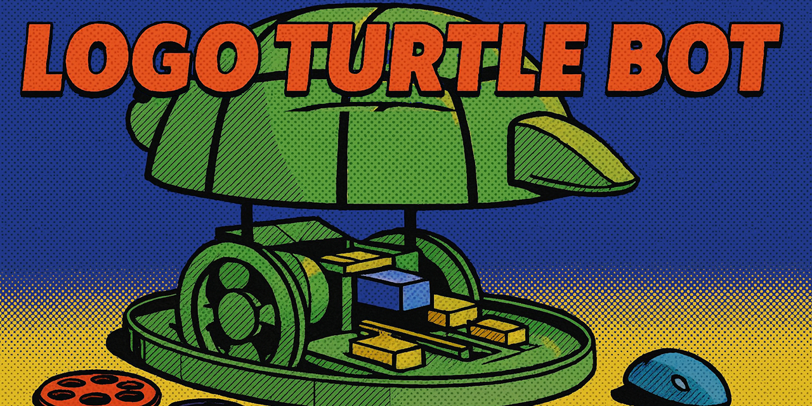
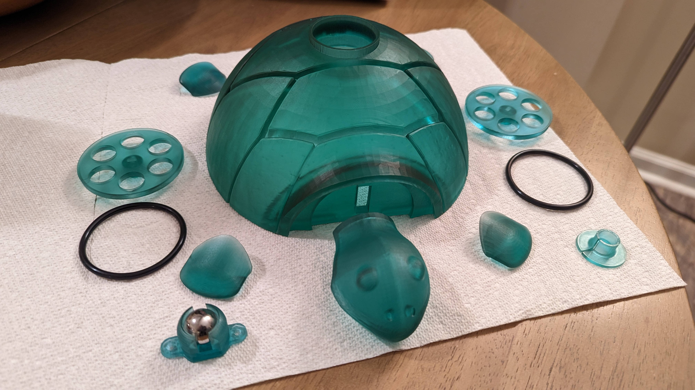
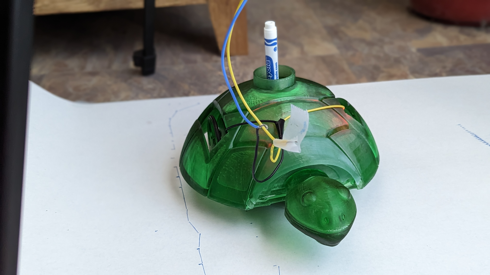
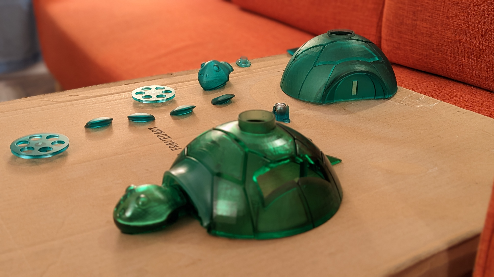

# Logo Turtle Bot

A physical implementation of Krell MIT Logo from the Apple II, brought to life in a 3D-printed turtle robot powered by a Raspberry Pi Pico.

> **AI-Assisted Documentation Notice**
> 
> Hello, fellow human! My name is Aaron Smith. I've been in the IT field for nearly three decades and have extensive experience as both an engineer and architect. While I've had various projects in the past that have made their way into the public domain, I've always wanted to release more than I could. I write useful utilities all the time that aid me with my vintage computing and hobbyist electronic projects, but rarely publish them. I've had experience in both the public and private sectors and can unfortunately slip into treating each one of these as a fully polished cannonball ready for market. It leads to scope creep and never-ending updates to documentation.
> 
> I created and compiled this codebase in early 2023 without the assistance of AI. When choosing to release it to the public, I leveraged GitHub Copilot and Claude Sonnet 4.5 to create the README.MD. All code is as it was originally created but the documentation has not been reviewed for accuracy. It may contain mistakes. If you find an error, please feel free to submit a pull request with a correction!

## Overview

This project is a childhood dream realized. Logo was my first programming language, learned on an Apple II Plus with Krell MIT Logo. While some fortunate schools had physical Logo turtles, most of us only had the on-screen version. This project brings that physical turtle to life, decades later.

The turtle is a fully functional Logo interpreter housed in a turtle-shaped 3D-printed shell. It features two motorized wheels, a servo-controlled pen that can be raised and lowered, rechargeable 18650 batteries, and an HC-05 Bluetooth module for wireless serial communication. You can connect via Bluetooth and see the same textual feedback that appeared on the Apple II screen while watching the turtle physically execute Logo commands.



## Hardware

- **Controller**: Raspberry Pi Pico
- **Motors**: Dual DC motors with motor driver for differential steering
- **Pen Control**: Servo motor for pen up/down movement
- **Power**: Rechargeable 18650 battery cells
- **Wireless**: HC-05 Bluetooth module for serial communication
- **Shell**: 3D-printed turtle design




## Features

- Full implementation of classic MIT Logo commands (FORWARD, BACK, LEFT, RIGHT, PENUP, PENDOWN, etc.)
- Bluetooth serial interface for wireless control
- Authentic text-based feedback matching the original Apple II experience
- Physical pen plotting on paper
- Battery management and recharging capability



## Software Architecture

The codebase is organized into several modules:

- `main.py` - Entry point for the Logo interpreter
- `logo_ce.py` - Command engine for Logo command processing
- `logo_ci.py` - Command interpreter
- `logo_cp.py` - Command parser
- `logo_motor.py` - Motor control interface
- `logo_stepper.py` - Stepper motor control (if used)
- `logo_terminal.py` - Terminal interface handling
- `logo_svg_to_log_converter.py` - SVG to Logo conversion utility
- `config.txt` - Configuration parameters

## Usage

Connect to the turtle via Bluetooth serial and type Logo commands as you would on an Apple II:

```
? FORWARD 100
? RIGHT 90
? FORWARD 50
? PENUP
? BACK 25
```

The turtle executes commands in real-time, providing textual feedback while physically moving and drawing.

## About Logo

### In the Beginning

In the mid-1960s, Seymour Papert, a mathematician who had been working with Jean Piaget in Geneva, came to the United States where he co-founded the MIT Artificial Intelligence Laboratory with Marvin Minsky. Papert worked with the team from Bolt, Beranek and Newman, led by Wallace Feurzeig, that created the first version of Logo in 1967.

Throughout the 1970s, Logo was incubating at MIT and a few other research sites: Edinburgh, Scotland and Tasmania, Australia. There were small research activities conducted in local schools, including the Brookline Public Schools, just up the Charles River from MIT. Dan Watt, Cynthia Solomon, and other MIT researchers documented their work with a small number of elementary school students using Logo.

The Logo Programming Language, a dialect of Lisp, was designed as a tool for learning. Its features—modularity, extensibility, interactivity, and flexibility—follow from this goal. Logo is designed to have a "low threshold and no ceiling": It is accessible to novices, including young children, and also supports complex explorations and sophisticated projects by experienced users.

The most popular Logo environments have involved the Turtle, originally a robotic creature that sat on the floor and could be directed to move around by typing commands at the computer. Soon the Turtle migrated to the computer graphics screen where it is used to draw shapes, designs, and pictures.

### Out Into the World

Widespread use of Logo began with the advent of personal computers during the late 1970s. The MIT Logo Group developed versions of Logo for two machines: The Apple ][ and the Texas Instruments TI 99/4. The Logo language itself was similar in both versions, but the video game hardware of the TI 99/4 lent itself to action-oriented projects, while the Apple version was best suited to turtle graphics and language projects.

The prototype Logo implementations used in those pioneering projects evolved into commercial products. TILOGO was released by Texas Instruments. Terrapin Software, a company that was set up in 1977 to distribute robot floor Turtles, licensed the Apple ][ version of MIT Logo and has marketed it and upgraded it to this day.

A new company, Logo Computer Systems, Inc. (LCSI) was formed in 1980. Many of the researchers, teachers, programmers, and writers who were involved in this venture have played major roles in the subsequent development of Logo. Seymour Papert was LCSI's chairman.

Another important event occurred in 1980—the publication of Seymour Papert's *Mindstorms*. Teachers throughout the world became excited by the intellectual and creative potential of Logo. Their enthusiasm fueled the Logo boom of the early 1980s.

### Innovation

In 1985, Logo Computer Systems, Inc. introduced LogoWriter, which was novel in several ways. First, it included word processing capability—hence the name. Second, the user interface was simplified and made more intuitive. LogoWriter was implemented in many spoken languages and became popular throughout the world.

Another innovation of the mid-eighties was LEGO Logo. Mitchel Resnick and Steve Ocko, working at the MIT Media Lab, developed a system which interfaced Logo with motors, lights and sensors that were incorporated into machines built out of LEGO bricks and other elements. Robotics systems with Logo were not new, but the popular and well-supported LEGO TC Logo was a commercial success which reached thousands of teachers and their students.

Logo received considerable support from mainstream computer manufacturers. Apple Computer marketed LCSI's Apple Logo and, at one point, bundled it with the computers given away to each school in California. IBM marketed LCSI's IBM Logo and Logo Learner.

Logo continues to influence educational programming environments to this day, with modern descendants including Scratch and other block-based programming languages.

## Personal Connection

Logo holds a special place in my heart as the first programming language I learned as a child on my Apple II Plus. We had Krell MIT Logo, and I spent countless hours programming the on-screen turtle to draw shapes and patterns. Learning more about Seymour Papert and his work, I discovered that some schools were fortunate enough to have physical Logo turtles—real robots that children could program to move around the floor and draw.

I always wanted one of those physical turtles. This project is the realization of that childhood dream, combining the nostalgia of Apple II Logo with modern microcontroller technology and 3D printing. Now, decades later, I can finally type those familiar Logo commands and watch a real turtle execute them.

## Media

Check out the `media` folder for more photos and videos of the turtle in action!

## License

This is personal vintage computing nostalgia code. Feel free to learn from it, adapt it, or build your own Logo turtle!

---

*In memory of Seymour Papert (1928-2016) and all the educators who brought Logo to children around the world.*
